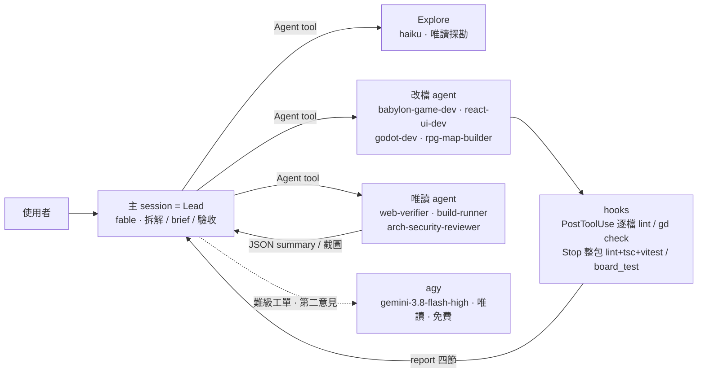

# collect · 開發流程設計（2026-09-07 版）

單 repo（React 19 + Babylon.js + 兩套 Godot Web 匯出）、單人開發。主 session 就是 Lead，派工走 Agent tool，規範靠 hooks 強制而不靠自律。本文件描述現況與理由；規則本體在 CLAUDE.md、`.claude/agents/*.md`、`.claude/skills/*/SKILL.md`、`.claude/hooks/*.sh`，衝突時以那些檔為準。

---

## 1. 一張圖



三層，各自只做一件事：

| 層 | 誰 | 做什麼 | 寫檔 |
| --- | --- | --- | --- |
| Lead | 本 session（fable） | 拆解、分類、寫 brief、派、三個機械檢查驗收、決定 BLOCKED | 只在直做門檻內 |
| worker | 專案 agent（Agent tool；上限 opus high） | 探勘、實作、驗證、審查——所有正式工作 | 改檔 agent 可，唯讀 agent 不可 |
| agy | Antigravity CLI，`gemini-3.8-flash-high` | 第二意見：審 diff／結論／計畫 | 不可；沒額度就沒有第二意見 |

---

## 2. 角色與模型

| Agent | model / effort | 工具限制 | 負責 |
| --- | --- | --- | --- |
| `babylon-game-dev` | opus / high | 禁 Agent | `src/babylon/`、`src/pages/Battle/`：遊戲邏輯、多人同步 |
| `react-ui-dev` | sonnet / high | 禁 Agent | `src/pages/`、`src/store/`、`src/components/`、`src/lib/` |
| `godot-dev` | sonnet / high | 禁 Agent | `godot-src/`、`godot-candy-src/`、Web 匯出 |
| `rpg-map-builder` | sonnet / medium | 禁 Agent | RpgRoom 地圖 JSON、場景圖轉 JSON |
| `build-runner` | sonnet / low | Bash, Read, Glob | `pnpm build`／匯出，失敗只回報 |
| `web-verifier` | sonnet / medium | Read, Bash, Glob；禁寫 | `shot.mjs` 截圖、Godot iframe、/battle 多人 |
| `arch-security-reviewer` | opus / high | Read, Grep, Glob, Bash | 架構、Firebase 規則、WebRTC signaling |
| 內建 `Explore` | haiku / sonnet low | 唯讀 | 多檔定位、找慣例，只回結論 |

- frontmatter 寫死 `model`／`effort`，不留 `inherit`（會繼承主 session 的 fable）。派工只能往下調。
- `haiku` 只准出現在唯讀格（Explore 易級、唯讀 worker 的 fallback 尾端）。
- 改檔 agent 加 `disallowedTools: Agent`：worker 不能再派工，派工只在 Lead。

路由矩陣（易／中／難各格的 model 與 effort）在 `herdr-team/SKILL.md` 第 1 節，此處不重抄。

---

## 3. 這件事該怎麼走

| 工作長相 | 走法 | 為什麼 |
| --- | --- | --- |
| 單檔 ≤30 行、不碰 `src/babylon/net/`、`src/core/`、`src/store/`、bridge 協定 | Lead 直做 | 派工的重載成本高於改動本身 |
| `.claude/` 設定與文件 | Lead 直做（現況慣例，尚未明文） | 沒有專案 agent 負責這個範圍 |
| 單點 grep、查一個值 | Lead 自己查 | 不值得一支 subagent |
| 多檔定位、找慣例 | `Explore` | 不要拿 opus 實作 agent 讀檔 |
| 明確的 `fix:`、已指定做法、樣式微調、地圖 JSON、Godot 匯出 | 直接派對應 agent，跳過 brainstorming | 不同解讀不會做出不同東西 |
| 需求模糊的新遊戲／新頁面／行為變更 | `superpowers:brainstorming` → spec → `writing-plans` → 派工 | plan 的缺口不會在 task 1 現形 |
| 所有 `fix:` | 套 `superpowers:systematic-debugging`；多人同步問題先用 web-verifier 兩個 context 重現 | 先重現、找根因，再改碼 |
| 純邏輯層（babylon math／net、Zustand store、糖果 board.gd） | TDD（vitest／board_test） | 其他層改用截圖驗證 |
| 架構／安全疑慮 | `/architecture-review`、`/security-audit`（fork 到 arch-security-reviewer） | 唯讀，可並行 |

---

## 4. 派工協定

### 4.1 通道

| 通道 | 何時 | 代價 |
| --- | --- | --- |
| **Agent tool**（預設） | 所有 worker 與唯讀審查 | 不重 spawn、不重載 CLAUDE.md／MCP、可並行、可 `SendMessage` 追問、可 `isolation: "worktree"` |
| `claude -p` | 要跨 session `--resume`、要 `total_cost_usd` | 每支重載約 14K token；一律 `--permission-mode auto --strict-mcp-config`（acceptEdits 不涵蓋 Bash） |
| herdr pane | 使用者要看它跑、agy 多輪追問 | 佔畫面、要手動收 |

### 4.2 brief 六段

寫到 `.claude/state/briefs/<slug>/task-N.md`，prompt 只給路徑。缺 `Files` 或 `Verify` 不派。派到 worktree 時這些路徑要寫主 repo 絕對路徑（`.claude/state/` 是 gitignore，worktree 裡是空的）。

| 段 | 寫什麼 |
| --- | --- |
| 目標 | 一句、可驗收 |
| Files | 允許改的檔案清單；diff 必須是它的子集 |
| 邊界 | 禁區、用到的獨佔資源、唯讀者明寫只讀、MODEL／effort |
| 證據 | `檔案:行號`，由 Explore 先找齊 |
| Verify | 這張工單特有的驗收指令逐字（hooks 已涵蓋的不重寫） |
| 產出 | report 路徑 `.claude/state/reports/<slug>/task-N.md`，四節 |

### 4.3 同波三道鎖

| 鎖 | 欄位 | 沒驗會怎樣 |
| --- | --- | --- |
| 時間 | 依賴 | 對著不存在的簽名寫 |
| 空間 | Files 不相交 | 後寫的靜默覆蓋先寫的 |
| 資源 | 獨佔清單不重疊 | 第二支把第一支的環境弄掉，驗證變假 |

獨佔資源清單：`dev:5173`（worktree 裡 `PORT=5174 pnpm dev` 可另開一支，鎖換成 `dev:5174`）、`export:godot`、`export:candy`、`maps`、`build:docs`、`firebase:battle`。

隱性編譯鎖：Stop hook 跑整棵樹的 `tsc -b` 與 vitest，一支 TDD 紅燈會擋另一支 headless worker 的 Stop。同波有 TDD 工單改序列或給 `isolation: "worktree"`（hook 會自動 symlink `node_modules` 與 `.env.local`；`.claude/state/` 路徑要寫主 repo 絕對路徑，dev server 要換 port，Godot 工單不進 worktree）。

並行規則：唯讀 agent 隨時可並行；同棵樹 in-process 改檔 agent 可並行但不改同一檔，改動由主 session 收工一次驗；`claude -p` 寫檔 worker 同棵樹同時只跑一支。

### 4.4 report 四節（改檔 agent 必交）

1. 做了什麼
2. 改了哪些檔（⊆ Files）
3. 怎麼驗證（Verify 逐字跑的結果；hooks 已跑的不重貼）
4. 殘留問題／QUESTION（沒有就寫「無」）

### 4.5 驗收 = 三個機械檢查

Lead 不讀實作邏輯。

1. brief 的 Verify 再跑一次
2. `git diff --name-only` ⊆ Files
3. report 第 4 節逐條看

三個都過 → APPROVED。任一不過 → 附上哪一條退回同一支。**連兩次退回 → BLOCKED**，回報使用者，不換模型硬推。

LLM 審查不逐工單做：難級工單在波尾派一次 `arch-security-reviewer` 看整波 diff，加 agy 第二意見；易／中級靠 hooks 與三檢查。

### 4.6 ledger

工單超過 3 張才啟用：`.claude/state/progress/<slug>.md`，append-only，一張 APPROVED 加一行。compact 或新 session 接手先 `cat` 它，不回頭翻 report。

### 4.7 agy 第二意見

- 只用 `gemini-3.8-flash-high`，`-p="…"` 語法，不帶 `--effort`。
- 一次約 14K token，合併成一支問，不拆小題。
- 只餵 diff／結論／計畫；金鑰、`.env`、測試帳號不進 prompt。
- 沒額度就回報「本次無第二意見」照原流程走；任何任務不得依賴 agy。

---

## 5. Hooks（`.claude/settings.json`）

| 事件 | 腳本 | 做什麼 | 耗時 |
| --- | --- | --- | --- |
| SessionStart | `session-start.sh` | 用 git 歷史比 Godot 源碼與產物（不用 mtime）；`.env.local` 缺 `VITE_FIREBASE_FIRESTORE_DB` 提示 | <1s |
| PreToolUse Bash | `pre-bash-guard.sh` | 擋 `pkill -f`、沒帶 `--headless --import` 的手動 godot 匯出、手動複製進 `public/godot/maps/`、jpg/png 寫進 `src/`／`public/` | <0.1s |
| PostToolUse Edit/Write | `post-edit-check.sh` | 單檔即時：`src/` TS 跑 `eslint --cache --fix`；`.gd` 跑 `godot --check-only`（濾 autoload 誤報）；地圖 JSON 驗合法並自動 sync:maps；糖果關卡 JSON 驗合法；export_presets Threads=ON 擋下；bridge 四檔互提醒。留 marker | 1s |
| Stop | `verify-on-stop.sh` | 只在 marker 存在時：eslint（共用快取）+ `pnpm typecheck` + vitest（dot reporter）；糖果 → `board_test.gd`；Godot 只提醒匯出。失敗只回尾段，exit 2 叫回來 | 冷 11s／暖 8s |

- **不掛 SubagentStop**：唯讀 subagent 不會被拖去驗、不會被叫回去修它改不了的東西。headless `claude -p` worker 是獨立 session，觸發自己的 Stop。
- `_common.sh`：定位 root、marker、eslint 快取參數、worktree 缺 `node_modules`／`.env.local` 自動 symlink。
- 狀態與 eslint 快取在 `.claude/.hook-state/`（gitignore）。marker 是「整棵樹有未驗證改動」，每棵樹一份。
- hook 驗證一律直呼 `$LBIN`（`node_modules/.bin/`）的 eslint／tsc／vitest，不走 `pnpm exec`：pnpm 11 的依賴驗證認不得 worktree 裡 symlink 來的 `node_modules`，會想 purge 它（那個 symlink 指主 repo），沒 TTY 就整個中止。worktree 內手動驗證也要用同一種寫法。
- 完成定義以 hooks 為準：lint 零錯誤、tsc 乾淨、vitest 全綠、board_test 全綠、Godot 產物已匯出。不另立標準。

---

## 6. 驗證

- 瀏覽器一律 `node .claude/skills/verify-web/scripts/shot.mjs`。本機沒 Chrome，Playwright MCP 已移除。腳本自動找 npx 快取的 playwright 與 `~/.cache/ms-playwright/` 的 chromium，輸出 JSON summary。
  - `--messages godot-rpg|godot-candy` 收 bridge postMessage
  - `--contexts N` 多人驗證，每玩家獨立 context
  - `--dns` 處理 WSL 瀏覽器 DNS
  - `--eval`、`--wait-for`、`--full`、`--dark`
- hash 路由 `http://localhost:5173/collect/#/<route>`；vite `strictPort`，5173 被占直接報錯不跳 port。
- /battle：Firestore 具名 DB `dkbo-collect`（專案 test-73ce3），`.env.local` 必填。
- 截圖與臨時腳本只寫 scratchpad，不進 `src/`／`public/`。

---

## 7. Token 與額度紀律

- MCP 只留 `context7`（`.mcp.json`）。filesystem／memory／github 與內建工具或 `gh` 重複，playwright 起不來。
- 預設 Agent tool，不重載；真要 `claude -p` 時追問走 `--resume`，小任務合併成一支。
- worker 預設 sonnet medium；opus high 只給矩陣粗體的難級格與被審查打回的實作。週上限逼近時 opus 格降 sonnet high，不停工。
- 實作前先派 Explore 把 `檔案:行號` 找齊寫進 brief，實作 agent 不讀檔找位置。
- web-verifier 用 JSON summary 回報，不貼整頁 snapshot。
- hooks 失敗輸出只回尾段（lint 60 行、tsc 60 行、vitest dot + 80 行）。
- 收工累加 `total_cost_usd` 回報派了幾支。

---

## 8. 規則落在哪個檔

| 規則 | 落點 | 誰讀 |
| --- | --- | --- |
| 技術棧、樣式、路徑別名、圖片 WebP | `AGENTS.md` | 所有人（其他 AI CLI 也讀） |
| Lead 身分、agent 表、hooks 摘要、Superpowers 優先序、產出目錄 | `CLAUDE.md` | 主 session |
| 路由矩陣、通道、brief 六段、三道鎖、驗收三檢查、agy 語法、額度 | `.claude/skills/herdr-team/SKILL.md` | Lead（派工前必讀） |
| 各 agent 職責、架構重點、報告四節 | `.claude/agents/<name>.md` | 該 agent |
| 瀏覽器驗證流程與 `shot.mjs` | `.claude/skills/verify-web/` | web-verifier |
| Godot 開發循環、匯出注意 | `.claude/skills/godot-dev/SKILL.md` | godot-dev |
| vitest 測試範圍與規則 | `.claude/skills/test-generation/SKILL.md` | 寫測試者 |
| 地圖 JSON schema、場景圖轉 JSON | `.claude/skills/rpg-map-generator/`、`rpg-scene-image-to-json/`、`map-scene-drawing/` | rpg-map-builder |
| 強制守門 | `.claude/hooks/*.sh` + `.claude/settings.json` | 機器 |
| 跨 session 記憶（工具鏈位置、Firebase 設定、坑） | `~/.claude/projects/-home-bal-project-collect/memory/` | 主 session |

目錄：

```
.claude/
  agents/            7 支專案 agent
  skills/            herdr-team、verify-web(+scripts/shot.mjs)、godot-dev、test-generation、refactor、
                     architecture-review、security-audit、frontend-design、ui-ux-pro-max、rpg-*、map-scene-drawing、img-to-webp
  hooks/             _common.sh、session-start.sh、pre-bash-guard.sh、post-edit-check.sh、verify-on-stop.sh
  settings.json      hooks 掛載、plansDirectory、typescript-lsp plugin
  settings.local.json  permissions（gitignore）
  .hook-state/       marker、eslintcache（gitignore）
  state/             briefs/ reports/ progress/（gitignore，活過 session）
  plans/             writing-plans 產出（gitignore）
  .superpower/       specs/ worktrees/（gitignore）
.agents/skills/      給其他 AI CLI 的 skill 副本（gitignore，勿刪）
.mcp.json            只有 context7
```

---

## 9. 刻意不做的

| 項目 | 為什麼 |
| --- | --- |
| 常駐 herdr lead session | 任務 5–30 分鐘，第二個 opus 常駐不划算；中途插話直接對主 session 說 |
| orchestrator + lead 雙引擎、交棒軌 | Lead 就是 orchestrator，一套夠 |
| Redmine／Gitea／codex-bot 送審閉環 | 沒有對應物，部署是 `build: 部屬` commit 進 `docs/` |
| plan >8 task 切 part、`_interfaces.md` 每波 append | 規模到不了；介面檔只在 babylon 與 react 同時改 bridge／store 時選用 |
| 獨立 plan-readiness-review skill | 三行檢查（Files、Verify、資源不重疊）寫在 herdr-team 就好 |
| Workflow tool 多 agent 編排 | 需使用者明確 opt-in；日常派工用 Agent tool |
| SubagentStop 驗證 | 唯讀 subagent 被拖去驗、被叫回去修，得不到任何東西 |
| 逐工單 LLM review | hooks 已擋機械錯誤；讀 diff 留給波尾一次 |
| `fable`／`xhigh`／`max` 派給 agent | 額度；上限 opus high 寫死在 frontmatter |

---

## 10. 已知限制與待驗證

- `disallowedTools: Agent` 在 agent frontmatter 的效果尚未實派驗證；第一次派改檔 agent 時看它是否還列出 Agent 工具。
- `.mcp.json` 移除 server 要重啟 session 才生效。
- worktree 內 `CLAUDE_PROJECT_DIR` 指哪裡仍未實測，但已不影響正確性：`hook_root` 改成 cwd 的 `git rev-parse --show-toplevel` 優先，只在它為空時才退回 `CLAUDE_PROJECT_DIR`。已用 detached worktree 實測：`CLAUDE_PROJECT_DIR` 硬指主 repo 時，PostToolUse 的 marker 仍落在 worktree、Stop 的 tsc 仍抓到只有 worktree 才有的型別錯（exit 2），主 repo 的狀態與 `node_modules` 都沒被動到。`settings.json` 裡 hook 的執行路徑仍用 `$CLAUDE_PROJECT_DIR`，那只決定跑哪份腳本（內容相同）。
- `godot --check-only` 不註冊 autoload，autoload 那行之後的編譯錯誤會被吞掉；真正的錯要靠匯出或 board_test 抓。
- session-start 的 Godot 過期判斷用 git 歷史，源碼與產物同一個 commit 進去時視為未過期。
- agy 沒有 `--resume`，多輪追問只能開 pane。
- Lead 的 context 沒人監測；長任務靠 ledger 與自覺 compact。
- `.claude/` 設定的修改由 Lead 直做是慣例，尚未寫進 herdr-team 的直做門檻。
