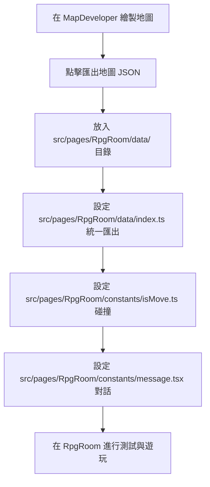

# 2D 地圖場景動態繪製與 RPGRoom 擴展指南

本 Skill 旨在指導開發者或 AI 代理人如何流暢地在專案中新增地圖、房屋、NPC 與對話，並說明動態地圖渲染技術。

---

## 🎨 核心概念與工作流

地圖開發包含兩個主要部分：
1. **地圖開發器 (MapDeveloper)**: 可視覺化繪製貼圖、框選碰撞範圍與傳送門。
2. **RPG 遊戲室 (RpgRoom)**: 讀取地圖 JSON 設定檔與 Spritesheet 拼圖庫，進行動態離屏預渲染，提供角色扮演與互動的遊戲體驗。



---

## 🛠️ 步驟指南 (Step-by-Step Instructions)

### 1. 地圖設計與匯出
1. 開啟地圖開發器頁面 (`/map-developer`)。
2. 設定地圖寬高（例如 `960x640` 或 `1920x1280`，建議為 32 的倍數）。
3. 使用拼圖庫（拼圖一、拼圖二）在畫布上擺設地圖元件：
   - **背景層** (`z !== 2`): 地板、草地、牆壁、矮樹等角色會在其前方的物件。
   - **前景遮罩層** (`z === 2`): 樹頂、高屋頂、吊燈等角色會在其後方的物件（能遮擋角色）。
4. 設定**碰撞區塊** (按住 `Alt` + 滑鼠左鍵拖曳)：
   - 繪製實體阻擋區（如牆壁、樹木、雕像）。
   - 設定傳送點（在傳送點的屬性上，設定 `cm` 地圖 ID 與 `cmm` 生成點索引）。
   - 設定對話觸發點（在觸發點屬性上，設定 `e` 事件 ID）。
5. 點擊「匯出 JSON」下載地圖的樣式與結構資料。

### 2. 地圖 JSON 資源配置
1. 將導出的地圖 JSON 檔案命名為 `000X_map.json` (X 為地圖 ID)。
2. 將檔案複製到 [src/pages/RpgRoom/data/](file:///home/bal/project/collect/src/pages/RpgRoom/data/) 目錄下。
3. 開啟 [src/pages/RpgRoom/data/index.ts](file:///home/bal/project/collect/src/pages/RpgRoom/data/index.ts)，將新地圖導入並加入到 `mapsJson` 陣列中：
   ```typescript
   import mapX from './000X_map.json'
   
   // ...
   export const mapsJson: MapJsonData[] = [
     // ...
     mapX as MapJsonData,
   ]
   ```

### 3. 配置 isMove.ts (地圖元數據與碰撞)
開啟 [isMove.ts](file:///home/bal/project/collect/src/pages/RpgRoom/constants/isMove.ts)，比照現有地圖格式加入新地圖資料：

```typescript
const ISMOVE_000X: MapData = {
  map: {
    index: X, // 地圖 ID (數字)
    name: '地圖區域名稱',
    width: 960,  // 地圖寬度
    height: 640, // 地圖高度
    in: [
      { x: 472, y: 580 }, // 傳送生成點 0
      { x: 100, y: 200 }  // 傳送生成點 1 (如有)
    ],
  },
  isMove: [
    // 牆壁碰撞 (阻擋)
    { n: '牆壁', x: 32, y: 32, w: 928, h: 32 },
    // NPC 互動觸發 (e 指向對話事件索引，例如 0)
    { n: 'NPC名字', x: 480, y: 352, w: 32, h: 32, e: 0 },
    // 傳送門 (cm 指向目標地圖 ID，cmm 指向目標地圖的生成點索引)
    { n: '傳送門', x: 448, y: 640, w: 64, h: 32, cm: 0, cmm: 1 }
  ]
}
```
並記得將 `ISMOVE_000X` 加到陣列尾端：
```typescript
export const isMoveObject: MapData[] = [
  // ...
  ISMOVE_000X, // 新增
]
```

### 4. 配置 message.tsx (NPC 與對話)
開啟 [message.tsx](file:///home/bal/project/collect/src/pages/RpgRoom/constants/message.tsx)，為新地圖新增 NPC 對話：

```typescript
const MESSAGE_000X: NpcMessage[] = [
  {
    name: 'NPC 名字',
    text: [
      '第一句對話。',
      '第二句對話，支持 JSX 標籤，例如：',
      <span key="custom">
        請按 <kbd className="bg-slate-700 text-slate-100 px-2 py-0.5 rounded text-xs font-mono">ESC</kbd> 觀看說明。
      </span>
    ]
  }
]
```
並加到 `messageObject` 陣列中：
```typescript
export const messageObject: NpcMessage[][] = [
  // ...
  MESSAGE_000X, // 新增，對齊地圖 ID
]
```

---

## 🏠 連接傳送門的檢查清單 (Portal Connection Checklist)

為了確保玩家能順暢地來回不同場景，請務必確認傳送門與生成點（`in` 座標）是雙向對齊的：
- [ ] **起點地圖門口**: `cm` 必須設為 **目標地圖 ID**。
- [ ] **起點地圖門口**: `cmm` 必須設為 **目標地圖 `in` 陣列中對應的生成點索引**。
- [ ] **目標地圖生成點**: 坐標 `x, y` 必須是能行走區域，且**不可與任何碰撞區重疊**（否則玩家傳送後會被卡住）。
- [ ] **目標地圖的出口**: `cm` 指回 **起點地圖 ID**，且 `cmm` 指回 **起點地圖的門口生成點索引**。

---

## ⚡ 動態地圖渲染技術細節 (Rendering Performance Guide)

為了保障遊戲能以 60 FPS 流暢度運作，RpgRoom 採用**離屏 Canvas 緩存預渲染機制**：
1. **Spritesheet 資源載入**：在頁面初始化時，統一加載人物圖片與拼圖庫 `rpg_maker_xp.png`/`rpg_maker_xp2.png`。
2. **預建離屏 Canvas**：當切換至特定地圖時，在記憶體中建立兩個 Canvas（`bgOffscreen` 與 `fgOffscreen`），並調整為該地圖大小。
3. **動態拼接地圖**：
   - 在 `bgOffscreen` 上先重複繪製 32x32 的重複草地背景。
   - 遍歷該地圖 JSON 中的 `styles`：
     - 若 `tile.z !== 2`，根據 `tile.b` 的索引（`1` 或 `2`）從對應的拼圖庫擷取切片（利用 `drawImage` 的 source 和 destination 參數）畫到 `bgOffscreen` 上。
     - 若 `tile.z === 2`，以同樣方式將遮罩層繪製到 `fgOffscreen` 上。
4. **極速幀渲染**：在 `requestAnimationFrame` 的繪圖循環中，主 Canvas 只需要使用 `drawImage` 直接將緩存好的離屏背景與前景 Canvas 渲染出來，避免了每幀迭代繪製數千個貼圖所造成的極大效能瓶頸。
